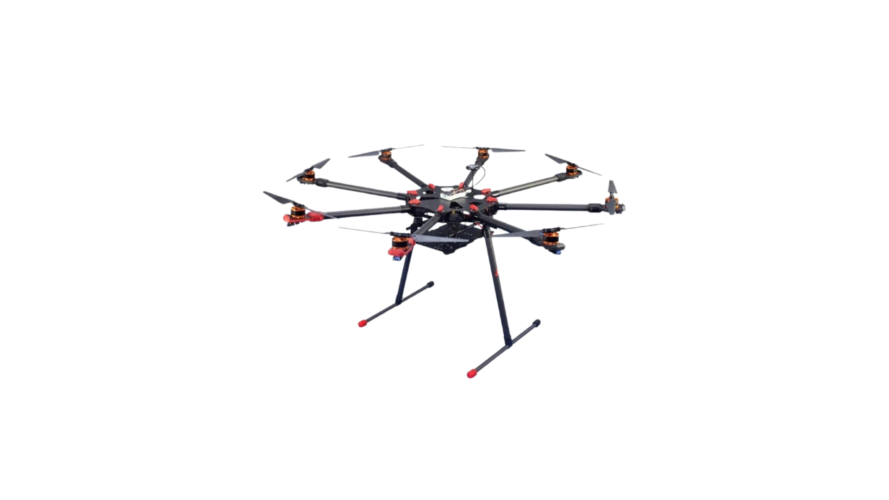
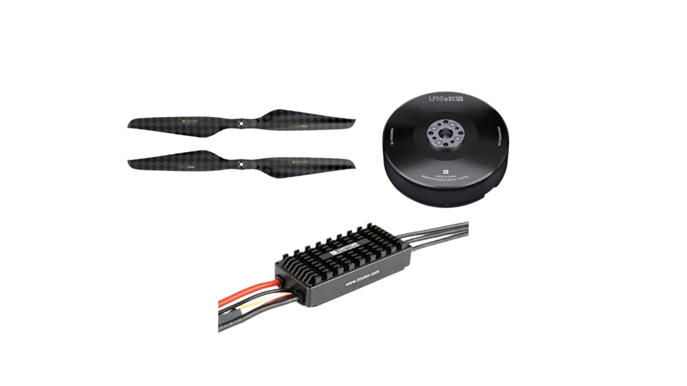
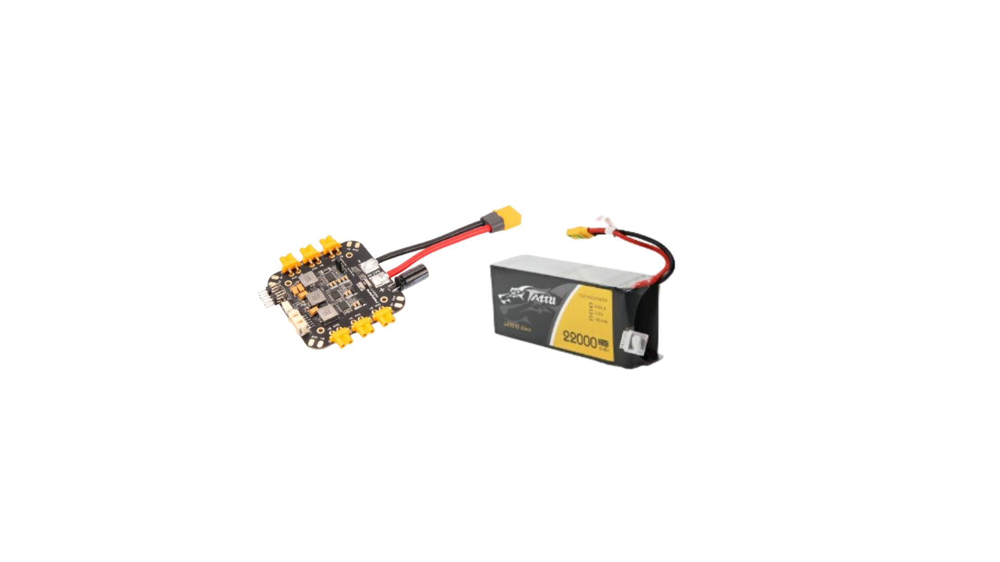
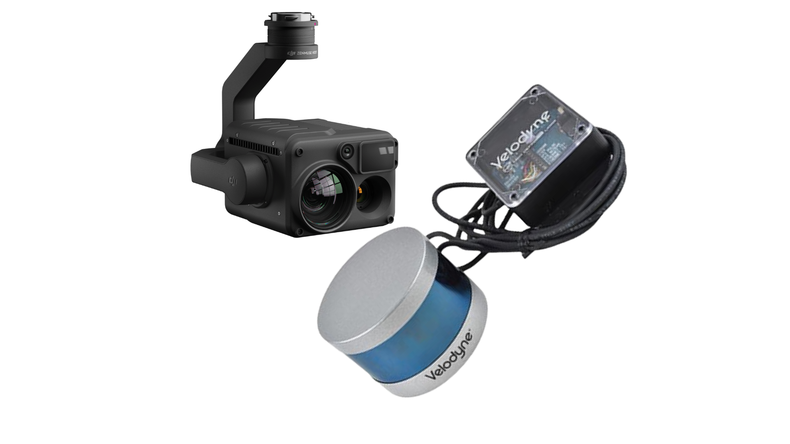
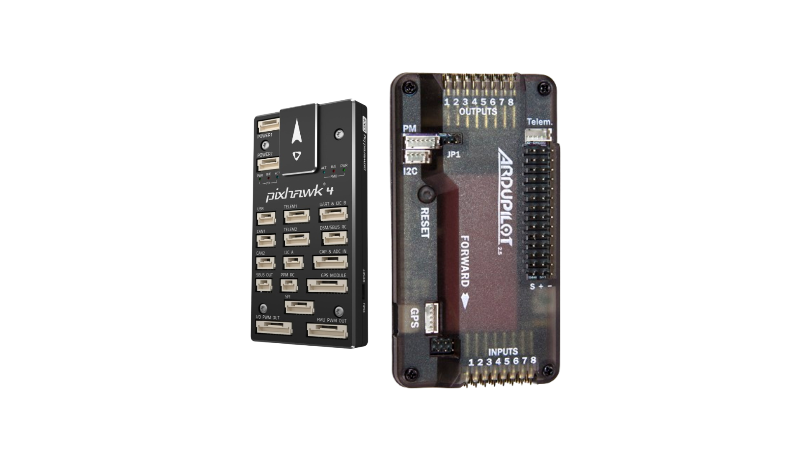

# Patrol 1: A Mission-Ready Quadrotor

## Project Overview
Patrol 1 is a group assignment for AE 234001 (Drone Technology) at university, focused on the engineering design of a mission-ready quadrotor for infrastructure inspection. The project delivers a comprehensive solution for power line and tower inspections, emphasizing long endurance, robust payload integration, and practical engineering.

---

## Mission Statement 🎯
**AE 234001 Group 5: Infrastructure Inspection**  
The objective is to design a mission-ready quadrotor for long loiter time, tailored for power line and tower inspections. The drone is engineered to deliver reliable, high-quality data capture over extended operational ranges.

---

## Key Features
- **Website**: Interactive project showcase and documentation.
- **Presentation (PPT)**: Summarizes design process, technical choices, and results.
- **Infographic Card**: Single-page visual summary of mission, specs, and design choices.

---

## Technical Design Summary
- **Flight Endurance**: >45 minutes
- **All-Up Weight**: 12.55 kg
- **Thrust-to-Weight Ratio**: 3.4:1
- **Operational Range**: 10 km
- **Subsystems & Components:**
	- **Airframe**: Tarot X8-II Class (heavy-lift, carbon fiber)
	- **Propulsion**: T-Motor U10 II & Flame ESCs (high efficiency)
	- **Power**: Tattu 12S 22,000mAh Li-Ion Pack (long endurance)
	- **Payload**: DJI Zenmuse H20T & Velodyne Puck LITE (sensor suite)
	- **Avionics**: Holybro Pixhawk 4 & ArduPilot (RTK GPS, robust control)

---

### Subsystem Components & Rationale

**Airframe: Tarot X8-II Class**
- 1100-1300mm heavy-lift frame, 3K carbon fiber
- Folding arms for portability, IP43 rating
- Strength-to-weight ratio and vibration damping for stable flight

**Propulsion: T-Motor U10 II & Propeller**
- U10 II KV100 motors, 10.6kg max thrust
- 28x9.2-inch carbon fiber propellers for efficiency
- Flame 80A 12S HV ESCs for smooth power management

**Power System: Battery & Distribution**
- Gens Ace Tattu 12S 22,000mAh 25C Li-Ion battery (185 Wh/kg)
- Holybro PM02D Power Distribution Board (PDB), 14S max, 120A cont.
- Clean, regulated power and telemetry to flight controller

**Payload: DJI H20T & Velodyne Puck**
- DJI Zenmuse H20T: 20MP zoom, 640x512 thermal camera
- Velodyne Puck LITE: 100m range, 300,000 pts/sec LiDAR
- 3-axis gimbal for stabilization

**Avionics: Pixhawk 4 & ArduPilot**
- Holybro Pixhawk 4 flight controller, ArduPilot firmware
- Holybro M8N GPS with RTK for centimeter-level accuracy

---

## Assignment Requirements Fulfilled
- Mission-driven engineering design
- Subsystem selection and justification
- Costing and timeline planning
- Infographic and presentation deliverables
- Website for project documentation
- Team collaboration and reporting

---

## Getting Started / Usage
To view the project files:
1. **Website**: Open the website folder (if available) and launch `index.html` in your browser.
2. **Presentation**: Find the PPT file in the repository and open with PowerPoint or compatible software.
3. **Infographic**: View or print the single-page infographic card (PDF or image format).
4. **Design Files**: Review technical documents and diagrams in the repository for detailed specs.

---

## Team
- Falgun Baria
- Adidev Shah
- Husain Lokhandwala
- AE 234001 Group 5 Members

---

## License
This project is licensed under the MIT License. See the `LICENSE` file for details.

---

## Frequently Asked Questions

**Q1: Why was a heavy-lift carbon fiber frame chosen?**
A: To support large propellers and heavy payloads, while ensuring vibration damping and portability.

**Q2: What makes the propulsion system efficient?**
A: Large, slow-spinning carbon fiber propellers paired with high-torque motors and reliable ESCs maximize thrust and endurance.

**Q3: Why use Li-Ion batteries over LiPo?**
A: Li-Ion offers higher energy density, enabling longer flight times critical for inspection missions.

**Q4: What is the role of the payload?**
A: The integrated sensor suite (EO/IR camera, LiDAR) enables detailed inspection and 3D mapping from a safe distance.

**Q5: How is precise navigation achieved?**
A: RTK GPS and robust flight control firmware ensure accurate geotagging and stable autonomous flight.

**Q6: How does the drone mitigate EMI near power lines?**
A: Smart placement of sensors, physical shielding, advanced software filtering, and operational standoff strategies.

**Q7: What drives the cost of the prototype?**
A: The payload (DJI H20T and Velodyne Puck) accounts for over 50% of the total cost due to its advanced capabilities.
